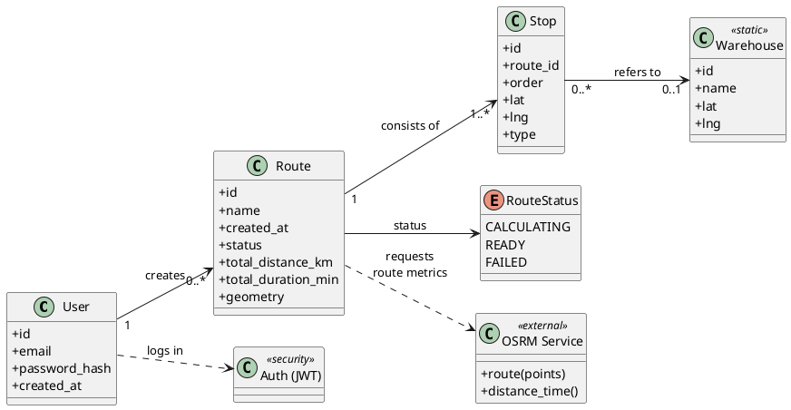

# Preču piegādes maršrutēšana 

## Problēmas nostādne

Mūsdienās preču piegādes procesu efektivitāte ir viens no galvenajiem faktoriem, kas ietekmē uzņēmuma konkurētspēju un klientu apmierinātību. Pieaugot e-komercijas apjomiem, arvien nozīmīgāka kļūst optimāla maršrutu plānošana, kas ļauj samazināt piegādes laiku, degvielas patēriņu un izmaksas. 
Maršrutu plānošana bieži ir sarežģīts uzdevums, kas prasa ņemt vērā daudzas mainīgās – transportlīdzekļu kapacitāti, klientu atrašanās vietas, piegādes laikus un citus ierobežojumus. Bez automatizētiem rīkiem šādu problēmu risināšana ir laikietilpīga un var radīt neefektīvus rezultātus.

## Darba un novērtēšanas mērķis

Darba mērķis ir izstrādāt tīmekļa lietotni preču piegādes maršrutu plānošanai un vizualizācijai, kas ļauj lietotājam izveidot, saglabāt un apskatīt piegādes maršrutus kartē. Izstrādātais risinājums nodrošina maršrutu aprēķinu, izmantojot ārēju maršrutēšanas pakalpojumu, kā arī atbalsta lietotāju autentifikāciju un maršrutu datu uzglabāšanu servera pusē. Sistēma paredzēta kā praktisks rīks loģistikas maršrutu plānošanas atbalstam, nodrošinot pārskatāmu maršrutu attēlošanu un ērtu lietotāja saskarni.
Novērtēšanas mērķis ir izvērtēt izstrādātās sistēmas funkcionalitāti, stabilitāti un lietojamību, pārbaudot maršrutu izveides, aprēķina un attēlošanas korektumu, kā arī datu saglabāšanu un atjaunošanu. Risinājuma kvalitāte tiek analizēta, balstoties uz testēšanas rezultātiem, sistēmas darbības loģisko pareizību un atbilstību izvirzītajām funkcionālajām prasībām.

## Līdzīgo risinājumu pārskats 

| **Serviss** | **Apraksts un novērtējums** |
|----------|--------------------------|
| **Google Maps** | _Google Maps ir viens no populārākajiem maršrutu plānošanass rīkiem pasaulē, kas piedāvā navigācijas un karšu pakalpojumus gan lietotājiem, gan izstrādātājiem caur Direction API. Tas ļauj aprēķināt maršrutus starp vairākiem punktiem, ņemot vērā reāllaika satiksmes apstākļus, attālumu un ceļa veidu. Plusi: 1. Vienkārša integrācija ar citām sistēmām caur REST API. 2. Precīzi un aktuāli ceļu un satiksmes dati no Google infrastruktūras. 3. Nodrošina aprēķinus pēc laika vai attāluma. Minusi: 1. Lietošana virs bezmaksas limita ir maksas pakalpojums (API izmaksas). 2.Nav piemērots liela mēroga loģistikas sistēmām bez papildu algoritmiskiem risinājumiem._ | 
| **Route4Me** | _Route4Me ir profesionāla maršrutu optimizācijas platforma, kas paredzēta uzņēmumiem ar piegādes, loģistikas un transporta vajadzībām. Tā nodrošina automātisku vairāku pieturas punktu maršrutu plānošanu un optimizāciju, samazinot kopējo braukšanas laiku un degvielas izmaksas. Plusi: 1. Atbalsta integrāciju ar ārējām sistēmām (piem., ERP, CRM, e-komercijas platformas), 2. Piedāvā reāllaika pārvaldību, vadītāju atrašanās vietu uzraudzību un piegādes statusa sekošanu. Minusi: 1. Komerciāls risinājums, kam nepieciešams abonements. 2. Nav pilnībā atvērta koda risinājums (ierobežota pielāgošana)._ |
| **OSMR** | _OSRM ir atvērtā koda maršrutēšanas dzinējs, kas izmanto OpenStreetMap (OSM) datus. Tas ļauj aprēķināt maršrutus starp punktiem ļoti ātri, izmantojot Dijkstra un Contraction Hierarchies algoritmus, kas nodrošina lielu ātrumu un precizitāti. Plusi: 1. Pilnībā bezmaksas un atvērtā koda. 2. Darbojas lokāli, bez ārējiem API ierobežojumiem. 3. Ļoti ātrs aprēķinu veikšanas laiks — piemērots lielām sistēmām. Minusi: 1. Nepieciešama servera uzstādīšana un tehniskā konfigurācija. 2. Nav lietotāja interfeisa — jāintegrē ar citiem risinājumiem. 3. Nepiedāvā pilnu piegādes flotes optimizāciju (VRP) bez papildu moduļiem._ |
| **RouteXL** | _RouteXL ir tiešsaistes maršrutu optimizācijas rīks, kas paredzēts maziem un vidējiem uzņēmumiem, kuriem nepieciešams ātri izplānot piegādes maršrutus vairākiem klientiem. Tas izmanto optimizācijas algoritmus, lai atrastu efektīvāko secību pieturas punktiem. Plusi: 1. Piedāvā bezmaksas versiju ar ierobežotu pieturu skaitu. 2.Vienkārši lietojams tīmekļa rīks ar vizuālu kartes interfeisu. 3. Ļauj importēt adreses no failiem vai kartes. Minusi: 1. Ierobežots maksimālais punktu skaits bezmaksas versijā (līdz 20). 2. Atkarīgs no interneta un RouteXL serveru pieejamības. 3. Nav piemērots lieliem transporta tīkliem._ | 
| **OptimoRoute** | _OptimoRoute ir komerciāla maršrutu optimizācijas platforma, kas paredzēta piegādes un servisa uzņēmumiem. Tā plāno maršrutus vairākiem transportlīdzekļiem, ņemot vērā piegādes laikus, attālumus, klientu prioritātes un transportlīdzekļu kapacitāti. Plusi: 1. Integrējams ar ERP un e-komercijas sistēmām (piem., Shopify, WooCommerce). 2. Piedāvā reāllaika uzraudzību un vadītāju atrašanās vietas izsekošanu. 3. Nodrošina maršrutu optimizāciju vairākām dienām uz priekšu. Minusi: 1. Komerciāls risinājums (abonēšanas maksa). 2. Nav atvērtā koda, ierobežota pielāgošana._|

## Konceptu modelis

## Tehnoloģiju steks

| Slānis | Tehnoloģija | Apraksts |
|--------|--------------|-----------|
| Frontend | React.js, CSS | Lietotāja saskarnes izstrādei – nodrošina interaktīvu un dinamisku tīmekļa vidi, kur lietotājs var apskatīt un pārvaldīt pasūtījumus un maršrutus. CSS tiek izmantots lietotnes vizuālajam noformējumam un izkārtojumam. |
| Backend | Flask | Servera loģikas īstenošanai – apstrādā lietotāja pieprasījumus, veic datu apstrādi un savienojumu ar datubāzi. |
| Datubāze | SQLite | Datu glabāšanai – saglabā informāciju par klientiem, pasūtījumiem, piegādēm un maršrutiem datubāzē. |
| Autentifikācija | JWT (JSON Web Tokens) | Lietotāju autentifikācijas un autorizācijas nodrošināšanai.
| Izstrādes vide | Visual Studio Code | Galvenā izstrādes vide projekta programmēšanai, testēšanai un kļūdu labošanai. |
| Kartes un maršruti | OpenStreetMap, OSRM | Maršrutu aprēķinam un ģeogrāfisko datu attēlošanai, izmantojot atvērtā koda kartogrāfisko datu avotu. | 
| Datu vizualizācija | Chart.js | Grafiku un diagrammu veidošanai – ļauj attēlot maršrutu statistiku, piegādes laikus un citu analītisku informāciju lietotāja saskarnē. |
| Servera izvietošana | Render.com | Timekļa lietotnes izvietošanai mākoņvidē. | 

## Plākāta gala versija

## Mājaslapa ir izvietota uz hostinga servera:

https://proj-lab-projekts-2.onrender.com/

